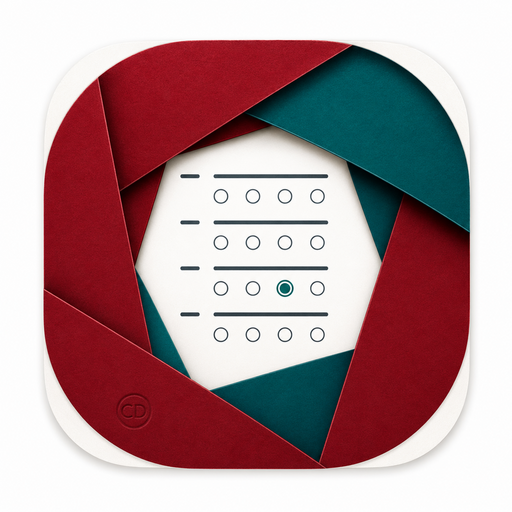

<p align="center">
  
</p>

<p align="center">
  <strong>Know when an active Moodle exam window loses focus.</strong><br>
  Privacy-first monitoring, live teacher evidence, no cameras and no external service.
</p>

# CD ExamFocus

CD ExamFocus is a Moodle quiz access-rule plugin that detects and documents when an in-progress quiz stops being the active browser tab or window. It warns the student on return and gives authorised staff a near-real-time, group-aware report.

The public brand is **CD ExamFocus**. The stable technical component remains `quizaccess_cdexamsave` so existing installations, upgrades and data remain compatible.

## Why it matters

AI assistants and online resources are easy to open during an unmanaged browser exam. CD ExamFocus adds a proportionate layer of integrity: it records focus-loss incidents that may indicate access to AI or another unauthorised resource, without using a camera, microphone, screen recording or third-party proctoring service.

The plugin reports what it can actually observe. **No focus-loss incidents detected** means the monitored quiz window remained active according to the browser signals received. It does not guarantee that no AI was used: another device, a browser-integrated assistant, an operating-system overlay, prepared content or client-side interference may remain invisible.

## At a glance

- Enable monitoring separately for each quiz.
- Detect hidden tabs, lost window focus and relevant page lifecycle events.
- Merge overlapping signals and ignore very brief changes with a configurable grace period.
- Notify the student after returning to the exam.
- Follow active attempts in a teacher report refreshed every 2–30 seconds.
- See focus state, connection state, incident count and accumulated time away.
- Receive optional native browser notifications for new incidents.
- Export the permitted incident history to CSV.
- Respect Moodle capabilities and separate groups on the server.
- Keep all monitoring data inside the Moodle site's own database.
- Apply configurable retention through Moodle cron and support the Privacy API.
- Require no API key, subscription or external dependency.

## What CD ExamFocus does not do

CD ExamFocus is a monitoring and deterrence aid, not a locked browser or automatic misconduct detector.

- It cannot prevent Alt+Tab or application switching.
- It cannot identify the destination tab, application or website.
- It cannot detect another device.
- It cannot guarantee that AI was not used.
- It cannot make an unmanaged browser tamper-proof.
- Legitimate operating-system dialogs, accessibility tools, notifications or connection problems can create incidents.

Every incident requires contextual human review. Do not apply an automatic academic or disciplinary penalty from this record alone.

## Requirements

- Moodle 4.5 or later according to `version.php`.
- A current browser with JavaScript enabled.
- Working Moodle cron for scheduled retention cleanup.
- HTTPS strongly recommended in production.

The initial public release targets Moodle 4.5 and later. The technical component name remains unchanged so existing CDexamSave installations on Moodle 4.5 can upgrade without losing their settings or monitoring data.

## Installation

### Moodle web installer

1. Back up the site and test on a staging copy.
2. Open **Site administration > Plugins > Install plugins**.
3. Upload the release ZIP; its single top-level directory must be `cdexamsave`.
4. Confirm the component `quizaccess_cdexamsave` and complete the database upgrade.
5. Purge Moodle caches.
6. Confirm that Moodle cron runs normally.

### Server installation

Copy `cdexamsave` to `mod/quiz/accessrule/`, visit **Site administration > Notifications**, complete the upgrade and purge caches. No Moodle core file is modified.

## Configure and use

Global limits are under **Site administration > Plugins > Activity modules > Quiz > Quiz access rules > CD ExamFocus**. The defaults are:

- data retention: 180 days;
- teacher report refresh: 3 seconds;
- student heartbeat: 10 seconds;
- disconnected threshold: 35 seconds;
- maximum incidents per attempt: 2,000.

For a specific exam:

1. Edit the quiz.
2. Open **Extra restrictions on attempts > CD ExamFocus**.
3. Enable focus monitoring.
4. Select the grace period and whether the student must acknowledge the return notice.
5. Save the quiz.
6. Open **CD ExamFocus live report** as an authorised teacher.
7. Test with a separate student account making a real attempt. Teacher preview attempts are intentionally excluded.

The report requires `quizaccess/cdexamsave:viewreport`. CSV export additionally requires `quizaccess/cdexamsave:exportreport`.

## Security and privacy by design

- Collector writes require a logged-in Moodle session and valid `sesskey`.
- The server verifies attempt ownership, non-preview status, in-progress state and per-quiz activation.
- Event and page-session UUIDs make writes idempotent.
- Report and export endpoints enforce context, capabilities and separate-group restrictions.
- Report cells use `textContent`; browser data is not injected as HTML.
- CSV export is hardened against spreadsheet-formula injection.
- No destination URL, browsing history, IP address, clipboard content, keystroke, screenshot, camera, microphone or biometric data is collected.
- Personal-data export and deletion use Moodle's Privacy API.
- A scheduled task enforces the configured retention period.

Before deployment, the institution should document necessity and proportionality, choose the legal basis, inform students, restrict permissions, define a false-positive review procedure and involve its data-protection officer where appropriate.

## Validation

Run the structural validator:

```bash
python3 tools/validate_release.py
```

From a Moodle development installation:

```bash
php admin/tool/phpunit/cli/init.php
vendor/bin/phpunit --testsuite quizaccess_cdexamsave_testsuite
```

Rebuild AMD assets after JavaScript changes:

```bash
npx grunt amd --root=mod/quiz/accessrule/cdexamsave
```

Real-browser and real-Moodle acceptance requirements are documented in `TESTING.md` and `docs/RELEASE_CHECKLIST.md`.

## Documentation

- [Administrator and teacher guide](docs/ADMIN_TEACHER_GUIDE_EN.md)
- [Guía para administración y profesorado](docs/GUIA_ADMIN_PROFESORADO_ES.md)
- [English Marketplace listing](docs/MARKETPLACE_LISTING_EN.md)
- [Ficha española para Marketplace](docs/MARKETPLACE_LISTING_ES.md)
- [Privacy notice template](docs/PRIVACY_NOTICE_TEMPLATE_EN.md)
- [Plantilla de información de privacidad](docs/PLANTILLA_INFORMACION_PRIVACIDAD_ES.md)
- [Brand guide](docs/BRAND_GUIDE.md)
- [Plan de lanzamiento y crecimiento](docs/LAUNCH_PLAN_ES.md)
- [Security policy](SECURITY.md)
- [Contributing](CONTRIBUTING.md)

## Maintainer

- Author and copyright holder: **Carlos Díaz Bueno**
- Institutional affiliation: **Colegio Sagrada Familia – Siervas de San José, Salamanca, Spain**
- Support: https://github.com/cdiazbu/moodle-quizaccess_cdexamsave/issues
- Issues: https://github.com/cdiazbu/moodle-quizaccess_cdexamsave/issues

The affiliation identifies the educational setting in which the plugin was developed. It does not by itself transfer ownership or legal responsibility to the school.

## Licence

GNU GPL v3 or later, matching Moodle.
